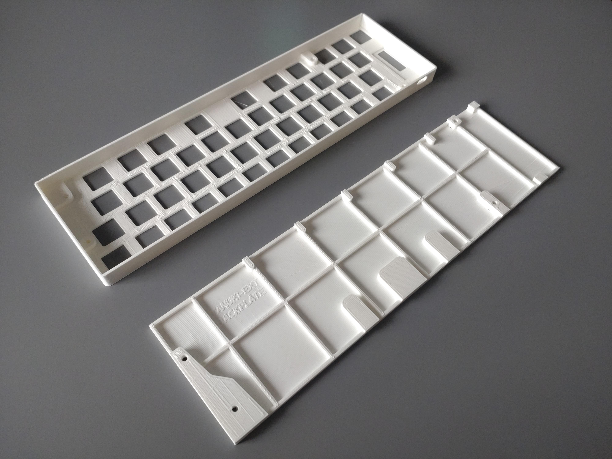
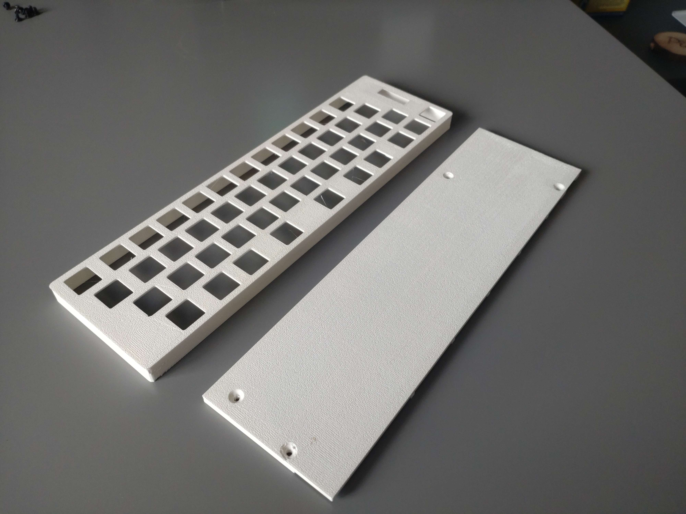

# Case
This folder contains all the information you need to build the case for the Tanuki-Ext Oled. There are 2 different files. One for the case itself that will hold the switches and one for the backplate. Both files are available in `.stl` format for easy printing and `.step` format for future editing and or mods. 

As you may notice from the pictures below the entire case can be 3d printed and just about fits on my 3d printer which has a bed of 245mm x 245mm.

| | |
| --- | --- |
|||
|*The parts as printed* | *The underside of the printed parts* |

## 3D printer settings
I printed all my cases in PLA with a 50% infill. Make sure that your bed is leveled well as both parts are prone to warping and peeling.

It is recommended that you print both parts with their flat faces down on the bed. This means you don't have to use supports and prevents potential lamination issues.

The 2 parts go together with M3 10mm bolts. The mating holes in the case are sized so that a normal M3 bolt should go in and self tap. I've found this method to be quite reliable but feel free to use self tapping screws or threaded inserts.

## Required hardware

| Part | Amount |
| ---- | ------ |
| M3 10mm Flathead bolt| 4 |
| Stickon rubber feet | 4 |
| 3D printing material for Backplate | 35g |
| 3D printing material for Case | 36g