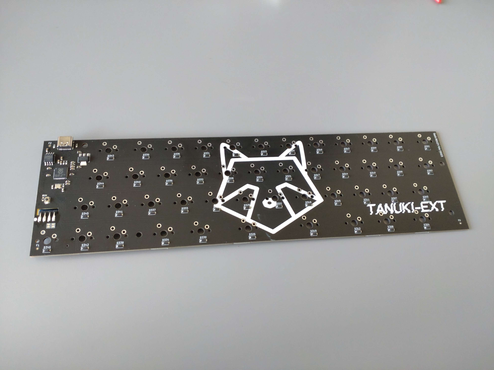
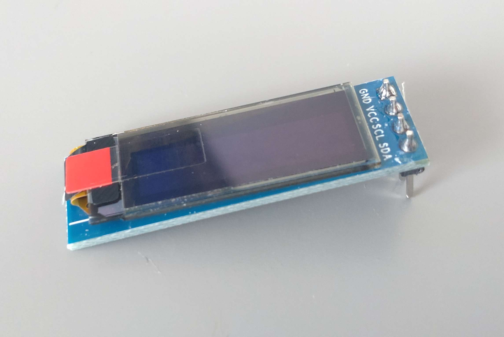
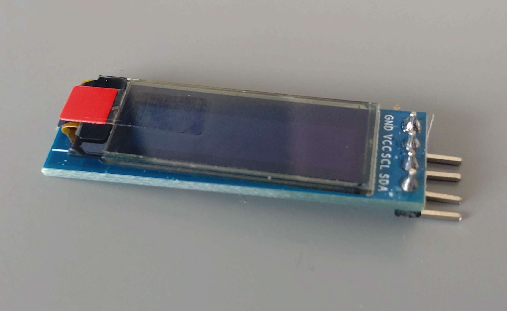
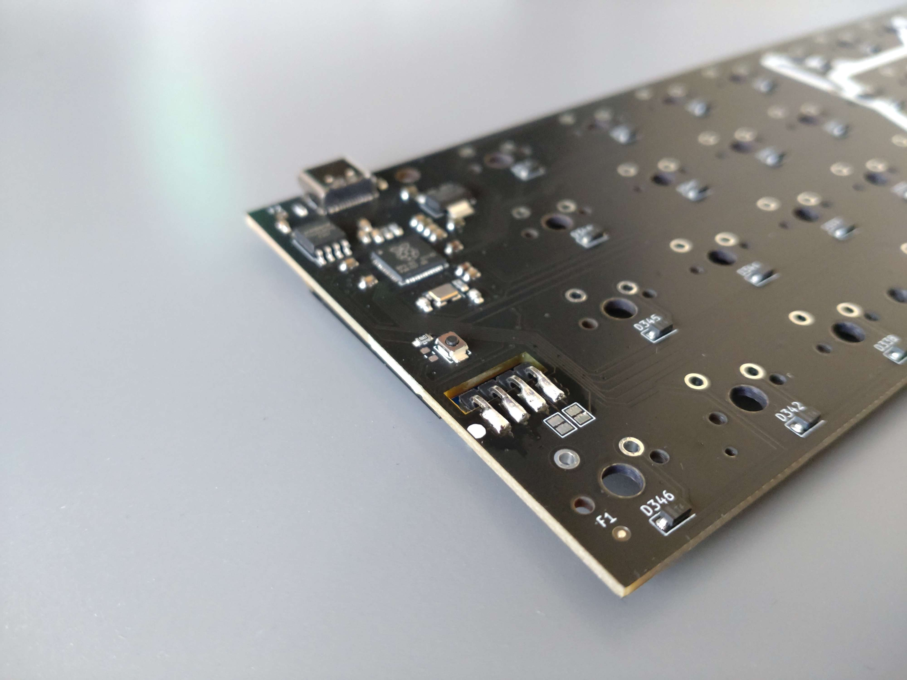

# PCB

The PCB was designed in KiCAD 7.0. It is set up to allow you to modify it more easily. It has a couple of GPIO pins broken out as test pads. It also has footprints for WS2812 type LEDS in case you don't want to integrate an OLED screen.

## Ordering PCB
The files in the _export folder contain both the gerbers, BOM and PNP files. These files are needed for a manufacturer to know how to make your pcb. What parts to place on it, and where to place those parts.

I ordered my prototype batch through JLC pcb and the export files are formatted as such. I decided to include them to make the process of making more PCB's as smooth as possible.

If you decide to have boards made at a different manufacturer you should check their knowledge base to make sure the files you give them adhere to their guidelines.

I would not recommend soldering this PCB by hand unless you know what you're doing. Some of the parts cannot be soldered with a soldering iron and require a hot air gun.
## Library
The folder contains a library for KiCAD 7.0 that holds the footprint for the 0.9 inch OLED module that this keyboard integrates. 
## Installing the OLED
The keyboard integrates a 0.91 inch OLED Display with a resolution of 128*32. It is driven by a SSD1306. See picture below.

I bought this OLED from a local electronic parts reseller. But you can find them pretty much everywhere. Like on this [AliExpress](https://www.aliexpress.com/item/32794209149.html?spm=a2g0o.productlist.main.5.206f631a8lDb8d&algo_pvid=6620102b-a939-4291-8e9b-3f810b9d6bed&algo_exp_id=6620102b-a939-4291-8e9b-3f810b9d6bed-2&pdp_npi=3%40dis%21EUR%213.36%212.02%21%21%21%21%21%40211be3cd16882988209694634d07b1%2165792120724%21sea%21NL%21797550893&curPageLogUid=jxX5Qj7G0Q6r) listing. Just make sure the order of the pins is the same as the module shown above and that it's based on the SSD1306.

In order to install the OLED onto the PCB you need to bend its pins outward like shown in the image below.

The OLED then slots into the cutout on the board and can be soldered to the pads on the other side.

Make sure that the part where the OLED module lays on the board is covered in a piece of tape of some sort. This is to prevent potential shorts between the pads for the LEDS that are in that location and the backside of the OLED module.